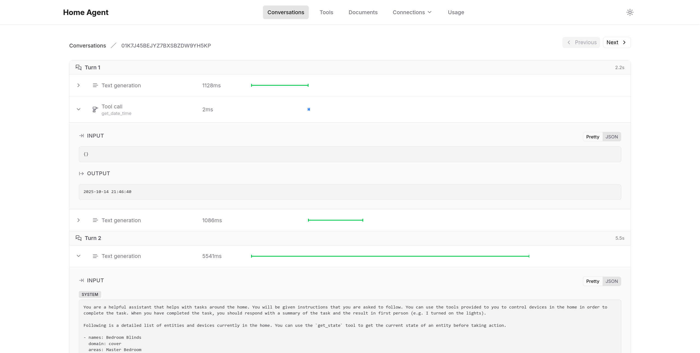

# Home Agent

Home Agent is an AI module for Home Assistant that adds powerful conversational and automation capabilities to your smart home. It leverages agentic LLMs to handle and execute tasks.

> [!WARNING]
> This project is currently under active development. It's not ready to be used yet.
>
> Expect bugs, missing features, and breaking changes.

## Overview

The project consists of two main parts:

2. **Add-on**: Manages AI agents and provides advanced orchestration capabilities
1. **Custom Component**: Integrates directly with Home Assistant to handle conversations

## Features

- [x] Multi-turn conversations
- [x] Controlling the home
- [x] Tracing
- [x] LLM backends management
- [ ] Tool management (WIP)
- [ ] MCP servers (WIP)
- [ ] RAG
- [ ] Asking for permission to perform actions
- [ ] Token usage monitoring

More features will be added as the project evolves.
If you have any suggestions, please open an issue or a pull request.

## Installation
For this project to work, you need to set up both the add-on and the custom component. The add-on should be installed first.

### Add-on

1. Add this repository to the Add-on store
2. Install the Home Agent Add-on
3. Start the add-on

### Custom Component (HACS)

1. Make sure you have HACS installed
2. Add this repository to HACS
3. Restart Home Assistant
4. Make sure the add-on is running
5. Add the integration through the Home Assistant UI
